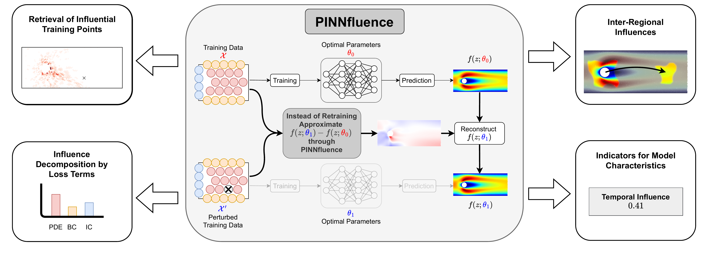

# PINNfluence: Interpreting PINNs through Influence Functions

*Aleksander Krasowski\*, Jonas R. Naujoks\*, Moritz Weckbecker, Galip Ü. Yolcu, Thomas Wiegand, Sebastian Lapuschkin, Wojciech Samek, René P. Klausen* — **ICML 2026**

[](https://arxiv.org/abs/2409.08958)




This repository provides a CLI and a small library to reproduce the experiments, figures,
and influence-based diagnostics from the paper.

You can find a demo notebook in [notebooks/demo.ipynb](notebooks/demo.ipynb) which recreates
the training and influence calculation for the drift-diffusion problem and shows how to
generate point-wise heatmaps from the results. It is also a good starting point for running
the analysis on the remaining problems. The demo runs reasonably quickly (≈ 5–20 min), so
feel free to play around.


### Abstract

> Physics-informed neural networks (PINNs) have emerged as a powerful deep learning approach for solving partial differential equations (PDEs) in the physical sciences, yet their behavior remains largely opaque and is typically understood through failure mode analyses rather than explicit interpretability. To address this issue, we introduce PINNfluence, a training data attribution framework for interpreting PINNs based on influence functions. By extending influence functions to composite physics-informed training objectives, we enable fine-grained attribution between predictions, loss components, and training data points. Through benchmark experiments across various PDEs, we demonstrate that influence patterns provide granular diagnostics that distinguish structural characteristics across well-trained and poorly-trained PINNs. PINNfluence thus opens a new avenue for understanding and improving the reliability of PINNs through the lens of their data. 


## Requirements

We heavily recommend using [uv](https://docs.astral.sh/uv/getting-started/) to create a
virtual environment and for quick dependency resolution.

If you're not familiar with it we recommend checking it out — although a plain `pip install .`
from the project root also works.

Create and activate a virtual environment, then install the package with its dependencies:

```bash
uv venv --python 3.13
source .venv/bin/activate
uv pip install .      # from inside the project root
```

### Alternative: installation using `pip`


```bash
pip install .         # from inside the project root
```

After installation you should be set to launch [notebooks/demo.ipynb](notebooks/demo.ipynb).

> Note: the code should work with other Python versions (requires `>=3.11`), but we only
> tested it on 3.13.

> Code was tested and should work on both Linux (`amd64`) and macOS (`arm64`).

## Reproducing the experiments

The package exposes three command-line entry points (run each with `--help` for the full
option list):

```bash
# 1. Pretrain a PINN (Adam + L-BFGS) for a given problem
python -m pinnfluence.pretrain --problem drift_diffusion --float64 --save_path ./model_zoo

# 2. Precompute influence scores for a trained checkpoint
#    --right / --left select the training- and test-side loss terms
python -m pinnfluence.precalculate_influences \
    --problem drift_diffusion --float64 \
    --load_path ./model_zoo --save_path ./model_zoo \
    --right total_loss --left total_loss

# 3. (Appendix C.4) Train with the SOAP or NNCG optimizer
python -m pinnfluence.pretrain_w_NNCG_SOAP --problem drift_diffusion --optimizer SOAP --float64
```

The seven problems in the paper are registered in
[`pinnfluence/utils/defaults.py`](pinnfluence/utils/defaults.py) (`PROBLEMS` for
well-trained, `BAD_PROBLEMS` for poorly-trained): `allen_cahn`, `burgers`, `diffusion`
(= Heat), `drift_diffusion`, `wave`, `navier_stokes_nd`, and `poisson_disk`.


## Citation

If you use PINNfluence in your work, please cite:

```bibtex
@misc{krasowski2026pinnfluenceinterpretingpinnsinfluence,
      title={PINNfluence: Interpreting PINNs through Influence Functions}, 
      author={Aleksander Krasowski and Jonas R. Naujoks and Moritz Weckbecker and Galip Ü. Yolcu and Thomas Wiegand and Sebastian Lapuschkin and Wojciech Samek and René P. Klausen},
      year={2026},
      eprint={2409.08958},
      archivePrefix={arXiv},
      primaryClass={cs.LG},
      url={https://arxiv.org/abs/2409.08958}, 
}
```

## AI usage disclosure

Parts of this repository were developed with the assistance of AI-based coding tools.
We have reviewed, tested, and curated the generated code to the best of our ability to
ensure it meets our quality standards and faithfully reproduces the results reported in
the paper. Nevertheless, as with any software, bugs or rough edges may remain. If you run
into a problem, please open an issue or a pull request — we are happy to take a look and
will do our best to address it.
